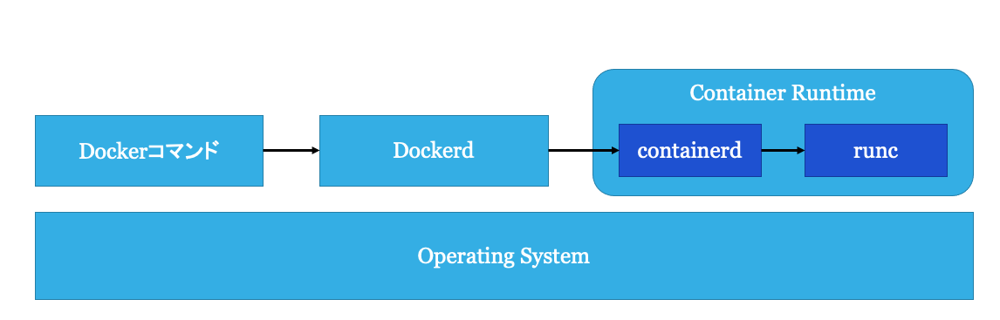

# Docker

## Agenda

話すこと
- Docker自体の説明
- Dockerの基本的な使い方

話さないこと
- Dockerの環境構築
- Docker Desktopなどの使い方

## 1. Dockerとは

Dockerとはコンテナ型仮想化ソフトウェアである．
Dockerは，コンテナの起動(Run)，コンテナイメージの作成(Build)，コンテナイメージの公開(Share)などの機能を持つ．
現在最も普及しているコンテナ型仮想化ソフトウェアであり，Amazon Web Service(AWS)のElastic Container Service(ECS)のようなコンテナプラットフォームや，開発者の開発環境など広く使われている．
Dockerはコンテナの中でもアプリケーションコンテナを扱う．
アプリケーションコンテナのことをDocker, Inc. は「A standardized unit of software (ソフトウェアの標準化された単位)」だと表現している[1]．
これは，コンテナとはコードと依存関係をパッケージ化したスタンドアロンなコンピューティング環境であり，高い可搬性(Portability)を持つということを指す．
要はDockerが入っているLinuxディストリビューションであればCentOSでもUbuntuでも同じコンテナイメージを用いてシステムを構築することができるというものである．

### Dockerのアーキテクチャ

Dockerは大きく分けて3つの要素から構成される．

- `docker` コマンド: Dockerの操作を行うためのCLI
- Dockerd: Dockerの操作を行うためのAPIを提供する
- Container Runtime: コンテナの実行や状態管理を行うシステム
