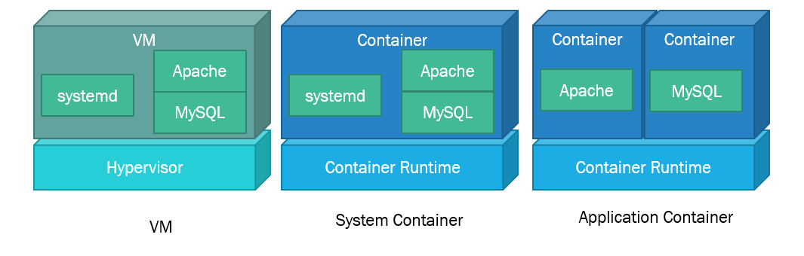

## コンテナの分類

### アプリケーションコンテナ

DockerやCRI-Oなどで用いられるコンテナはアプリケーションコンテナと呼ばれる．
アプリケーションコンテナは単一関心事の原則(Single Concern Princile)という考え方を採用しているコンテナである．
シンプルに表現すると，1つのコンテナ内で実行するアプリケーションを1つに限定するという原則である．
これにより，コンテナ内のアプリケーションの依存関係をシンプルにし，スケールが容易になるといったものである．
LAMP(Linux, Apache, MySQL, PHP)でいうと，Apache(+ PHP)とMySQLを別々のコンテナとして利用し，リクエストの増加に応じてApacheのコンテナのみをスケールすることができる．

### システムコンテナ

LXC(LXD), OpenVZはシステムコンテナと呼ばれるコンテナ環境である．
システムコンテナとは，アプリケーションコンテナと異なり，複数のアプリケーションが動作し，実際のLinux OSと同様に動作するものである．
systemdなどのinit processが動作し，複数のデーモンプロセスを動かすことが可能だ．
1つのコンテナのイメージサイズは大きいが，VMなどの構成をそのまま移行することも比較的容易である．
LAMP(Linux, Apache, MySQL, PHP)を1つのコンテナで動かすようなもの．

