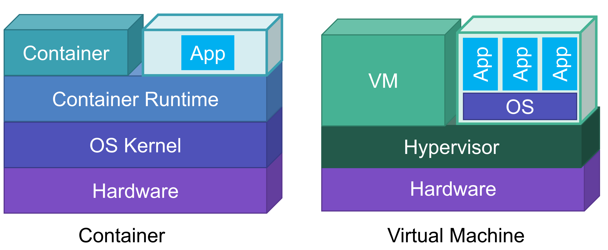

# コンテナ勉強会 概論編

## 仮想マシン

仮想マシン(VM)はハイパーバイザによって提供される仮想的なハードウェア上で複数の OS を同時に実行できる技術である．
1つの物理マシン上に複数のVMを集約することで計算機資源を柔軟に管理することが可能である．
Linux では KVM (Kernel-based Virtual Machine) などを利用して仮想マシンを構築することができる．

## コンテナ型仮想化

コンテナ型仮想化とは，アプリケーションの実行環境を作成する仮想化技術の1つである．
VM と異なる点は仮想環境内に OS カーネルが存在しない点である．
これにより仮想環境の実行に OS の起動が必要ないため，高速な起動を実現できる．
VMが1つのハードウェアを多重化して複数のハードウェアに見せかけたりするのと比べ，
コンテナはOSを仮想化し，あたかも異なる複数のOSのようなものが実行されているように見える．
コンテナはコンテナを提供するホストOSカーネルによって管理される．
ホストOS側からはコンテナは単なるプロセスとして見える．
しかしコンテナ内からは，ホストから様々なリソースを隔離されている．

**注意**: コンテナ型仮想化では，ホストのOSカーネルを使ってコンテナを作成する．そのため，ホストOSと異なるOSのコンテナを作成することはできない．LinuxではLinux, WindowsではWindowsのコンテナのみ作成できる．

コンテナは様々な用途で利用され，Webサービス等だけではなく組み込み機器，Machine Learningなどでも利用されることが増えてきた．
誤解を恐れないでいうと，コンテナが向いていないワークロードをベアメタルかVMを用いて運用するという方向になりつつある．

コンテナが向いていない要件
- カーネルモジュールなどに大きく影響するシステム
- パブリッククラウドなどにおける不特定多数が利用するマルチテナンシーな環境
- レスポンスタイムがシビアなシステム(仮想NICなどを経由することが多くなるため)

コンテナ型仮想化技術はOSカーネルをホストと共有するため，OSカーネルやコンテナ実行環境の脆弱性に気をつける必要がある．

